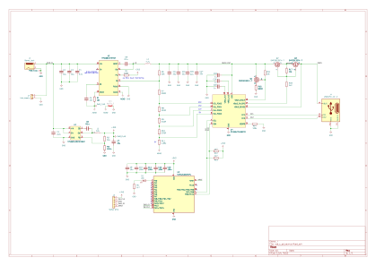
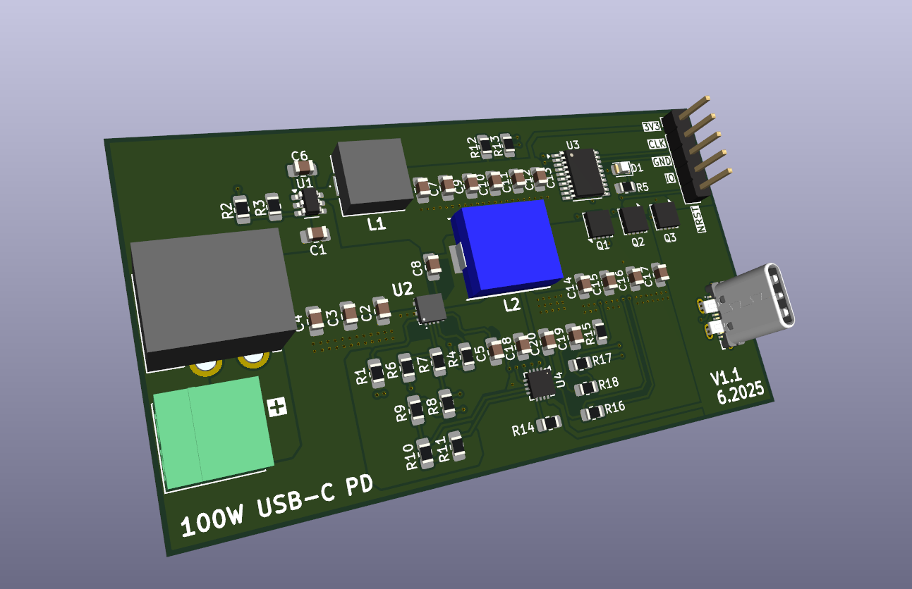

# 100W USB-C Power Delivery Module

A high-power USB-C Power Delivery (PD) module capable of delivering up to **100W (20V @ 5A)**. 

---

## Project Contents

This repository includes:
- KiCad design files (`.kicad_pro`, `.kicad_pcb`, `.kicad_sch`)
- **Gerber files** for PCB fabrication
- **BOM** file (`usb_c_pd_source.csv`)

---

## Description

The project is based around the STUSB4710 Autonomous USB PD controller IC. The design functions as a power source with short-circuit protection and Vbus monitoring.
The project is configured in a buck topology, meaning there is a constant 24 V DC voltage at the input of the circuit. Using the TPS56837HRPAR buck converter, the PD IC sets the output USB-C compliant voltage. The project is hardware-heavy — the MCU is only needed to monitor the buck converter and to increase the current on the 20 V PDO from 2.25 A to 5 A

## Schematic

The schematic of the circuit is shown below:

---

## 3D View

The 3D render of the assembled PCB:

